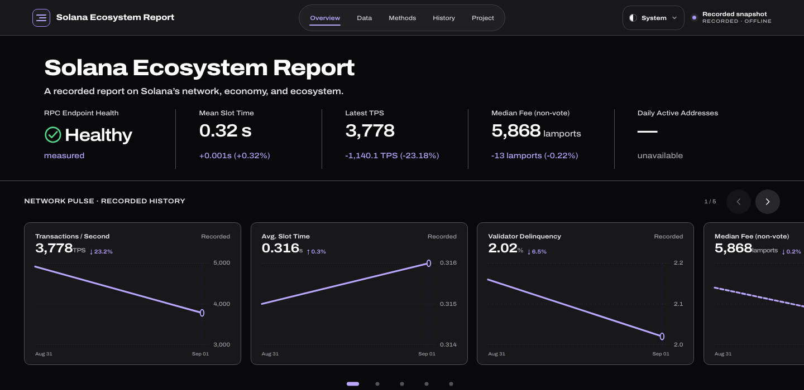
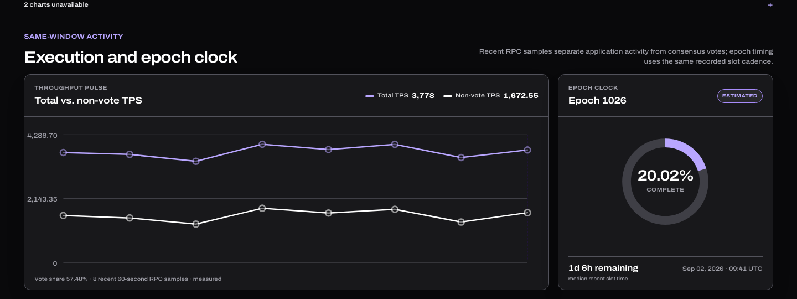

# Solana Ecosystem Report

[](https://ashtonships.github.io/solana-ecosystem-report/)

**An auto-updating, evidence-labelled report on the state of the Solana network** — [view the live report](https://ashtonships.github.io/solana-ecosystem-report/).

The local collector can record a bounded **keyless Solana JSON-RPC core**,
append-only snapshots and metric facts, compare compatible observations, and
render a self-contained HTML dashboard, a human-readable Markdown report, and
machine-readable JSON from one selected snapshot. Scheduled collection never
falls back to the public endpoint: it requires an owner-approved RPC endpoint.

Optional adapters exist for economic, activity-provider, tokenized-equity,
release, proposal, news, and status sources. They are not all cleared for public
retention or redistribution: the production workflow disables economics, while
the adopted news and growth paths do not request their held sources. Held
sections render unavailable rather than being silently republished.
The current public decisions are summarized below. Private release audits and
controller receipts are deliberately excluded from the publication package.

**Python standard library only.** The local keyless default needs no API key,
account, third-party package, or build step. `git clone` and run. Production
automation has a separate endpoint gate because Solana's official documentation
says its public RPC is not intended for production applications.

## What it looks like

Every published byte is generated from committed snapshots — the dashboard, the charts, and the honest unavailable states you see below are the artifact itself.



## Reading the dashboard

- **Overview:** network instruments and total/non-vote TPS history with recorded-value inspection.
- **Data:** validator and market visualizations, provider comparisons, feature activation, sampled activity, and searchable evidence catalogs.
- **History:** select recorded A/B snapshots and inspect their values, limits, and latest-comparison threshold findings.
- **Methods:** measurement definitions, validation rules, and evidence limits.
- **Project:** collection workflow, source chronology, and report context.

Desktop and mobile retain the same evidence destinations. Provider comparisons
show each source independently over the last 30 calendar days; missing dates
remain gaps and provider methodologies are not averaged together. The complete
history remains in JSON. Markdown bounds the leader-production table to the
100 identities with the most leader slots, with its full population in JSON.

## Quick start

Collect a fresh local candidate and render all three outputs with one shell
command. The default public RPC is suitable for this bounded verification path,
not as an implicit production endpoint:

```bash
python3 collect.py && python3 render.py
```

The equivalent steps, including optional inspection commands, are:

```bash
python3 collect.py          # bounded local RPC, adopted growth + first-party metadata → snapshots/
python3 detect.py           # anomalies across accumulated history
python3 render.py           # snapshot → dist/index.html, report.md, report.json
open dist/index.html        # macOS — xdg-open on Linux, start on Windows
```

No install step. Requires Python 3.10+ (uses only `urllib`, `json`, `pathlib`,
`datetime`, `argparse`, `html`, `statistics`, `xml.etree`).

```bash
python3 collect.py --dry-run              # print without writing
python3 collect.py --endpoint <RPC_URL>   # alternate RPC
python3 collect.py --dry-run --with-economics  # private research only; never writes held output
python3 collect.py --no-news              # skip first-party news and optional X announcements
python3 collect.py --dry-run --with-price --with-dune  # optional keyed sources; no evidence writes
python3 collect.py --no-growth            # opt out of adopted registry and finalized-RPC growth facts
python3 render.py --snapshot <PATH>       # render a specific snapshot
python3 pipeline.py --max-age-seconds N   # pre-publish gate: nonzero exit stops publication
python3 delta.py                          # what changed since the previous snapshot
python3 charts.py                         # what the snapshot history can chart
```

## Data sources

Local core-network collection comes from **public Solana JSON-RPC** through
bounded calls.
Public endpoints commonly answer small calls but stall on a combined response
containing `getVoteAccounts`; isolating methods makes one timeout degrade only
its own section. Every HTTP response body is also capped at 16 MiB before
decoding. The default endpoint requires no authentication.

| Method | What it provides |
| --- | --- |
| `getHealth` | Health of the responding RPC endpoint; not network-wide health |
| `getSlot` | Current slot |
| `getEpochInfo` | Epoch number, progress, block height, cumulative transaction count |
| `getEpochSchedule` | Exact completed-epoch slot range used for production evidence |
| `getRecentPerformanceSamples` | Same-window total/non-vote TPS, vote share and slot time |
| `getSupply` | Total, circulating, and non-circulating SOL |
| `getVoteAccounts` | Active vs delinquent validators, stake distribution, commissions |
| `getInflationRate` | Current effective total, validator, and foundation inflation rates |
| `getInflationGovernor` | Initial, terminal, taper, and foundation policy parameters |
| `getBlockTime` | Wall-clock time of the current slot (depends on `getSlot`) |
| `getBlock` | Per-transaction fees, signatures, account keys and balance deltas |
| `getBlocks` | Block production rate used to scale a sampled slot window |
| `getBlockProduction` | Identity-level production over exact finalized completed-epoch chunks |

The local default endpoint is Solana's currently documented
`https://api.mainnet.solana.com`. Its official cluster documentation says the
public service is rate-limited, may block high-traffic users, and is not intended
for production applications. The update workflow therefore requires an
owner-approved endpoint through the `REPORT_RPC_ENDPOINT` repository secret and
fails before collection when it is absent.
The older `https://api.mainnet-beta.solana.com` compatibility endpoint, or any
other public RPC, still works via `--endpoint`.
Custom endpoint URLs are used only in memory: schema-8-and-later snapshots and rendered
outputs retain the literal label `custom RPC endpoint` plus an opaque SHA-256
identity, never the URL or embedded credentials. Their API-key requirement is
reported as unknown rather than guessed.

### Fees, REV and address activity — sampled from block bodies

The brief names Real Economic Value, median transaction fees and daily active
addresses. None of them are available from the summary RPC methods above; they
have to come out of block bodies, which is what `blocks.py` does.

`getBlock` at `transactionDetails: "accounts"` returns each transaction's fee,
message signatures, account keys and pre/post balances while dropping
instruction data. By default, sixteen blocks are sampled across a fixed
216,000-slot span. The snapshot records the first and last sampled slots and
block times and reports their **exact observed wall-clock duration**; it never
renames that duration "24 hours."

| Metric | How it is derived |
| --- | --- |
| Median / mean / p90 / p99 fee | Distribution over **non-vote** transactions only |
| Message-signature base-fee lower bound | 5,000 lamports x message-signature count, capped at the recorded fee |
| Unclassified fee residual | Transaction fee minus that lower bound; may include priority fees and supported-precompile signature fees |
| Jito tips | Positive balance deltas on the eight accounts in Jito Labs' pinned `getTipAccounts` source (`93dec9d…`); recorded 8/8 factual identifiers only |
| REV | Recorded transaction fees + detected Jito tips |
| Fee burn | Total fees minus the block's own `Fee` reward entry |
| Address activity | Unique non-vote first-account fee payers and accounts touched in sampled blocks |

The sampled metrics preserve these distinctions:

**Vote transactions are separated out.** They are the bulk of Solana's
transaction count and every one pays exactly 5,000 lamports. Include them and
the median fee is always 5,000 — a number that is technically correct and tells
you nothing about what it costs a person to use the network. They still count
toward REV, because they are real lamports paid.

**Fee burn is measured, not assumed.** Each block carries a `Fee` reward entry
recording what the leader actually received; burn is total fees minus that. No
fee-split rule is hardcoded. Accounts-only block data cannot expose supported
precompile signatures, so the report publishes only the message-signature
base-fee lower bound plus an unclassified residual. The residual is not labelled
as an exact priority fee.

**The fee payer is the first account key.** Other signers are not counted as
fee payers. The sampled unique count is still only a sampled observation, not a
daily or network-wide active-address total.

**Daily active addresses are reported as unavailable, not estimated.** Sums
extrapolate from a systematic sample; unique-address counts do not, because
samples overlap. The sampled count is published and labelled as a sample, and
the daily figure is left null. Multiplying it up would have been the easy way
to fill the cell and would have overstated it.

REV is reported first for the sampled blocks, then as a sample-mean estimate
across the exact sampled slot window using the measured block-production rate.
Its descriptive 95% interval describes dispersion among sampled blocks; it does
not remove temporal or endpoint/network sampling bias. It is not a daily total.

Run `python3 collect.py --no-activity` to skip block sampling, or `--samples N`
to change the depth. Sampling stops after a 90-second budget and marks the run
truncated rather than stalling a collection when the public endpoint throttles.

### Optional ecosystem sources and release holds

The repository contains adapters for additional public endpoints, but technical
access is not the same as permission to retain and redistribute their data.
Current production defaults keep uncleared sources out of new public candidates.

| Source or capability | Current decision | Public-output contract |
| --- | --- | --- |
| Solana JSON-RPC | Local candidate; owner-gated for automation | Keyless bounded local core; scheduled updates require an approved endpoint contract and secret; retain exact slots, times, coverage, and source state |
| Jito tip-account identifiers | Owner-gated | The local candidate retains the exact pinned 8/8 set; automated live refresh and public Jito-derived metrics require owner acceptance of the current Jito Tooling Terms |
| DEX Screener | Defer / held | The public path does not call the API; current terms do not establish permission for automated public redistribution of derived aggregates |
| Agave releases | Adopt, metadata/link only | Stable release flags plus resolved tag commit; no copied release bodies |
| Solana Status | Adopt, factual metadata/link only | Current official state and incident metadata; an old newest incident is not source staleness |
| CoinGecko Demo price | Adopt, keyed | `--with-price` uses `COINGECKO_DEMO_API_KEY`; source timestamp and USD/SOL unit retained; missing/stale price never values held metrics |
| DeFiLlama | Defer / externally blocked | No new public republication until permission or a licensed replacement is established |
| Solana Data numeric rows | Adopt, scoped | Owner accepted public redistribution on 2026-09-01 for Active Addresses only: provider-scoped daily ranges, never a canonical network-wide count; Fee Payers and all other rows stay held |
| Solana Foundation token registry | Adopt at fixed revision | Exact-`xStock` mint identities only; MIT notice retained; no logos or hosted market data |
| Selected four-mint stablecoin supply | Adopt, scoped chain fact | Finalized RPC supply for four pinned mints; not circulating supply, value, liquidity, depth, or all stablecoins |
| xStocks public API | Defer / externally blocked | API terms need clarification; the adopted on-chain path does not call this API |
| Firedancer releases | Adopt, metadata/link only | Five official release records; no copied release bodies |
| SIMD proposal frontmatter | Adopt, metadata/link only | Watched proposal title/status/link only; proposal status is distinct from mainnet activation |
| Solana News and curated upgrades | Defer / held | No RSS or repository-archive collection; Agave and Solana Status remain the active first-party metadata sources |
| Dune activity query | Optional, keyed | Completed UTC daily query results with execution identity, age, row hash and coverage; executions require a durable once-per-day reservation and explicit allowance |
| X official announcements | Optional, keyed | Four-account recent search, at most 20 posts; finite total/day request reservations precede transport; missing approved remaining allowance pauses paid reads |

The table above is the public source-decision summary. Endpoint, cadence,
freshness, coverage, failure, attribution, and terms evidence must be rechecked
before a new source is promoted from deferred to adopted.
Economics are disabled by default. `--with-economics` is an explicit private-
research opt-in that requires `--dry-run`; it cannot write held data into the
canonical snapshot/fact paths or advance `latest.json`. The adopted growth path
calls only the adopted Solana Data Active Addresses feed plus the pinned
registry and finalized RPC methods; it does not call DEX Screener, the held
xStocks API, DeFiLlama, or any other provider endpoint; `--no-growth` is only
an explicit opt-out from those fixed sources. The default news collector fetches Agave, Firedancer, Solana Status and watched
SIMD frontmatter metadata. Optional X reads require a token plus an approved
remaining-budget ledger. Held Solana News, full proposal text and curated-upgrade
archives are not requested.

**Each optional section degrades independently.** A held, stale, rate-limited,
or failed source renders `—` with its state, never a fabricated zero. Network-
wide daily active addresses remain unavailable: dated provider observations,
when cleared, stay provider-scoped and are never collapsed into a canonical DAA
or "unique humans" count.

The adopted growth path resolves the exact `xStock` label from one fixed,
MIT-licensed Solana Foundation token-registry revision and checkpoints
finalized supply by mint. Each row retains the raw amount, decimals, RPC UI
string, supply and mint-account context, and its exact token-program provenance.
Token-2022 rows require Scaled UI Amount multiplier evidence; the one validated
legacy SPL Token mint retains the corresponding mint-account provenance. The
report never sums heterogeneous equities into one number.
The same path also records finalized total supply for four
explicitly named stablecoin mints. Both views disclose exact numerator and
denominator coverage; selected-stablecoin totals and shares appear only at
4/4, and neither view is labelled as circulating supply, valuation, reserves,
liquidity, depth, or complete market coverage.

### Derived metrics

Not everything is read straight off the wire — some of the more useful numbers
are computed:

- **Total and non-vote TPS** — same-window transaction counters divided by
  `samplePeriodSecs`; multi-sample rollups divide summed counts by summed time.
- **Slot time** — `samplePeriodSecs / numSlots`; this report alerts above
  0.60s. That alert policy is not a protocol target or a measured value.
- **Epoch ETA** — remaining slots multiplied by median recent measured slot time.
- **Nakamoto coefficient** — the smallest number of validators that together
  control more than one third of active stake. The standard concentration
  measure for a proof-of-stake chain, and more informative than a raw validator
  count because the supporting stake distribution determines concentration.
- **Delinquency rate** — delinquent validators as a share of all validators.

## Architecture

```
blocks.py / optional source modules
              │
              ▼
collect.py ──► pipeline.py pre-write publication gate
              │
              ├──► snapshots/snapshot-<UTC>.json  append-only evidence
              ├──► snapshots/latest.json          selected copy, not a symlink
              ├──► history/facts.jsonl             compact compatible metric facts
              └──► state/xstocks-supply.json       optional resumable supply cursor
                               │
                 facts.py compatibility contract
                    ┌──────────┼──────────┐
                    ▼          ▼          ▼
                detect.py   delta.py   charts.py
                    └──────────┼──────────┘
                               ▼
render.py ──► pipeline.py gate ──► dist/index.html
                                  dist/report.md
                                  dist/report.json
```

The pipeline uses these contracts:

**Snapshots are the source of truth, and they are append-only.** Rendering
never touches the network. `facts.py` gives anomaly, delta, and chart consumers
one versioned per-metric compatibility contract. Equivalent historical meanings
may be adapted; corrected or incompatible meanings remain explicit gaps.

**Collection fails closed before it writes evidence.** `pipeline.py` validates
schema, nested semantics, freshness, source-state relationships, coverage, and
collection provenance before a snapshot, fact append, or cursor update is
accepted. Schema-9 snapshots retain the collector Git revision and dirty-tree
state. Rendered outputs add one release ID derived from the selected snapshot's
SHA-256 plus selected-snapshot, collector, renderer, schema, projection,
observation-contract, and generation provenance. One recursive public projector
removes fields outside the versioned publication contract from every artifact;
raw evidence remains unchanged.

**Network access is confined to the fetch helpers.** In each module the
functions that touch the network are separated from the ones that shape data,
and everything in the second group is pure. That is why the entire test suite
runs offline, and why an RPC outage cannot produce a subtly wrong report — only
a visibly degraded one.

**Optional sections fail alone.** A source failure or release hold records
`available: false` for that section and leaves independent evidence intact.
`blocks.py` stays denominated in SOL because that is what the chain reports;
USD context appears only when a separately eligible price observation exists.

## Automation strategy

The checked-in workflow keeps pushes and pull requests verify-only: they run the
offline suite, validate the current snapshot, and prove the committed
source-to-data parent, exact path set, immutable snapshot, monotonic collection,
append-only facts, and current Git blobs. They never collect, render, upload, or
deploy.

Manual `bootstrap` uploads exactly the three committed files under `samples/`
without collecting or rendering. It requires the canonical
`release-manifest.json`, exact committed sample bytes, the audited
source-to-data-to-package chain, and an owner-set
`REPORT_BOOTSTRAP_MANIFEST_SHA256` secret matching that manifest. Scheduled
updates intentionally do not rewrite this archival bootstrap package.

Manual `update` and the requested hourly schedule (`17 * * * *`, UTC) are enabled only when the
repository variable `REPORT_AUTOMATION_ENABLED=true`. Even then, update fails
before collection unless the `REPORT_RPC_ENDPOINT` repository secret identifies
an owner-approved production endpoint; the secret value is not written to
snapshots or artifacts. An enabled update tests, reserves eligible paid requests,
commits and pushes their ledgers before any paid call, then collects with held
sources disabled. It validates the complete changed-path set, commits only the
approved data paths, renders that committed data revision with one frozen
timestamp, and verifies all three artifacts. It pushes before archiving; a push
failure therefore prevents artifact upload and deployment. Build/update has
only contents permission, while the separate deployment job alone receives
Pages and OIDC permissions. Every third-party action is pinned to an immutable
commit.

GitHub may delay scheduled runs. The collection timestamp and source-event
windows are the evidence of actual freshness; an hourly cron is not an hourly
delivery guarantee. The detector separately retains its six-hour baseline policy:
observations less than five hours apart cannot masquerade as independent
six-hour priors. A failed collection, gate, render or push stops deployment and
leaves the previous hosted release in place.

Paid execution/read switches default to off. A bearer token alone does not
establish remaining allowance. See [operations and spending controls](docs/operations.md)
for the exact ledgers, receipt order, failure recovery and account checks.

**Degradation is deliberate.** If a single RPC method fails, that section
reports `"available": false` and the report renders the section as
*unavailable* rather than as zero. A missing metric and a metric that is
genuinely zero must never look the same on a dashboard, and a partial outage
should not lose the metrics that did succeed.

## Anomaly detection

`detect.py` compares the newest snapshot against median baselines drawn from
the accumulated history. Detector logic is fixed and deterministic:

| Detector | Fires when | Severity |
| --- | --- | --- |
| `network_unhealthy` | The recorded RPC endpoint's `getHealth` does not return ok | critical |
| `network_health_unavailable` | The recorded RPC endpoint produced no usable health state | warning |
| `tps_drop` | TPS ≥40% below baseline median | critical |
| `tps_spike` | TPS ≥60% above baseline median | info |
| `slot_stalled` | current slot is not ahead of the previous snapshot | critical |
| `delinquency_high` | ≥5% of validators delinquent | critical |
| `delinquency_jump` | delinquency up ≥2 percentage points vs baseline | warning |
| `slow_slots` | mean slot time exceeds this report's 0.60s alert threshold | warning |
| `supply_move` / `stake_move` | circulating supply ±1% / active stake ±5% | warning |
| `sol_price_move` | SOL price ±15% against the snapshot median | warning |
| `tvl_move` | Solana TVL ±15% against the snapshot median | warning |

Thresholds live in one `THRESHOLDS` dict at the top of `detect.py` so an
operator can tune them without reading detector code.

Two decisions worth calling out:

**The baseline is a median, not a mean.** One anomalous snapshot in the history
would drag a mean far enough to mask the next real event. There is a test for
exactly this: a 100,000 TPS outlier in the baseline must not hide a subsequent
75% drop.

**Too little history reports `insufficient_history`, never "no anomalies".**
This is the distinction the whole tool turns on. With no baseline, an empty
findings list means *we cannot tell yet* — not *the network is fine*. The
status field says so explicitly, the report renders it in grey rather than
green, and the message reads "Absence of findings here means no baseline, not
a healthy network."

**Eligibility is per metric.** Each metric reports whether its current value is
eligible, how many compatible cadence-qualified priors exist, how many rapid
observations were excluded, and whether its baseline is sufficient. One mature
TPS history cannot make a newly corrected REV series look mature; the overall
status remains `partial_coverage` while any judged metric lacks current or
baseline evidence.

```bash
python3 detect.py                  # human-readable
python3 detect.py --json           # machine-readable
python3 detect.py --min-history 5  # demand a deeper baseline
```

Release samples must be regenerated from the final rights-safe candidate and
deep-compared with its HTML and JSON. Historical samples are not current proof.

## What changed since the last snapshot

`delta.py` compares the two newest snapshots and reports what moved, why it
matters, and what to check — as a pure function, so the same two snapshots
always produce identical output. It renders into all three formats.

Every metric declares its own movement threshold in one table at the top of the
module, alongside the two lines of context printed when it moves. Nothing is
generated per run: the tool explains what a metric *means* and never narrates
what it thinks happened.

Three rules keep it honest:

**A metric missing from either snapshot is "not comparable", never a change.**
The side that is missing is named. Treating an absent value as zero would
manufacture a -100% collapse out of a source outage; treating it as unchanged
would hide a real one.

**A percentage against a previous value of zero is declared undefined.** There
is no honest percentage there, so none is printed.

**Sampled metrics carry looser thresholds than measured ones.** A 12% swing in
an extrapolated REV figure is sampling noise; the same swing in measured TPS is
an event. They are also rendered distinctly, so the two never look alike.

```bash
python3 delta.py            # human-readable
python3 delta.py --json     # machine-readable
```

## Historical charts

`charts.py` draws the accumulated snapshot history as inline SVG — TPS, slot
time, delinquency, SOL price, TVL, median non-vote fee, and REV over its exact
observed window.
Generated by stdlib Python into the HTML itself: no chart library, no
JavaScript, no external asset, not even an SVG namespace URL. The Markdown
report gets the same series as a table and the JSON gets the raw points.

**Only compatible recorded facts are plotted.** Nothing is statistically
smoothed, resampled or back-filled, and a series with fewer than two usable
points is not charted at all — it is listed as "not charted yet, and not drawn
as zero." Incompatible historical semantics remain visible gaps. The History
A/B view connects recorded sample coordinates with straight SVG segments, so
it adds no observations and cannot overshoot either endpoint.

The Overview presents all seven supported series in a full-width, scroll-snap
carousel: TPS, slot time, validator delinquency, SOL price, TVL, median non-vote
fee, and REV over the observed window. It works as a native horizontal scroller without
JavaScript; progressive enhancement adds previous/next controls, keyboard
navigation, a position readout, and direct chart selectors.

**Gaps are drawn as gaps.** Two kinds break a line: a snapshot where the metric
is absent, and a stretch of wall-clock time longer than 2.5x the median
collection step. If CI was down for a day, the line stops and restarts. Sloping
smoothly across the outage would be a picture of data nobody collected.

The compact Overview is the deliberate exception to the timing heuristic. This
repository history was collected ad hoc and declares no cadence, so Overview
spaces available observations by recorded-sample order and breaks only on an
explicit missing value. The endpoint labels still show the real time span, and
the chart does not infer intermediate observations. The detailed chart surfaces
retain the 2.5x heuristic for cadence-shaped series.

**Sampled series never look measured.** The median fee and the REV estimate come
out of a small block sample; TPS and slot time are read off the wire. The
sampled ones are a different hue *and* dashed *and* badged, so the distinction
survives a colourblind reader and a greyscale print rather than resting on hue.

Charts scale from two points to hundreds: individual markers below twelve
points, an endpoint marker and per-observation hover bands above. Hover detail
is a native SVG `<title>`, so it needs no script, and every value it shows is
also in the JSON.

## Releases, status, and held editorial sources

`news.py` and `upgrades.py` keep each source independently degradable. The
release-safe default fetches bounded first-party metadata:

| Source | Implemented design | Release decision |
| --- | --- | --- |
| Agave GitHub releases API | Classify draft, prerelease, and stable rows from source flags and tag suffixes; retain the five newest rows plus the latest stable release; resolve retained tag commit SHAs | Adopt factual metadata and canonical links only |
| Solana Status APIs | Retain current page state, page source-update times, and returned incident metadata; distinguish source time from collection time and missing incident evidence from zero incidents | Adopt factual metadata and links; component state is not retained |
| Firedancer GitHub releases | Retain the five newest official release records | Adopt metadata and canonical links |
| Watched SIMD frontmatter | Retain title, lifecycle status and canonical link | Metadata only; no proposal body or inferred activation |
| X recent search | Four allowlisted accounts, at most 20 posts, original publication times | Optional paid read; finite precommitted allowance required. Failed reads may retain an explicitly archived previous set |
| Solana News or Solana.com curated upgrades | No default RSS or repository-archive fetch | Held: the whole-repository archive is not a bounded production transport |

Each source records unavailable, partial, or recorded evidence independently.
An old newest Status incident does not make the status source stale, and a
successful request with incomplete incident evidence never becomes "zero
incidents." Rendering remains offline because eligible metadata is retained in
the selected snapshot. Use `--no-news` only when an RPC-only collection is
explicitly desired.

The Project briefing keeps one eligible published item as the permanent hero
and shows up to three source-diverse supporting records. Story links go directly
to the validated canonical primary-source host. The snapshot currently retains
metadata, not accepted article bodies, so it does not generate thin internal
detail pages. Reviewed local presentation art is selected by story category;
the release hero and supporting release cards use distinct locally embedded
raster illustrations. The update path does not scrape or hotlink publisher
artwork. Any future source-image collector must first add a rights decision,
host allowlist, byte and media-type limits, content hash, attribution record,
and a tested local fallback.

Release artwork candidates can be generated after a recorded collection without
changing report evidence. They are retained for review and are not wired into
the report automatically. The script generates only missing candidates for the
three newest Agave releases and requires an explicit API key:

```bash
export OPENAI_API_KEY="your-key"
python3 scripts/generate_weekly_release_art.py
python3 -B render.py --snapshot snapshots/latest.json --out-dir preview --replay
```

Use `--dry-run` to inspect the exact prompts without an API call. The command is
safe to invoke weekly: existing release files are skipped unless `--force` is
passed. It wraps the bundled OpenAI image CLI from `$CODEX_HOME`; set
`IMAGE_GEN_CLI` only when that CLI lives elsewhere.

## Output formats

- **`dist/index.html`** — five-view Overview, Data, Methods, History, and Project
  editorial dashboard with inline SVG charts,
  one self-contained file with inline CSS. No CDN, external asset, external
  script, runtime dependency, or build step; opens from `file://` with the
  network down.
  First visit defaults to System; native controls offer Light, Dark, and System
  under the persisted `solana-report-theme` preference.
  Headline figures use compact notation (`434.4M SOL`) with the exact value
  beneath. Deterministic UI-only states are available for browser QA through
  `?ui=loading`, `?ui=empty`, and `?ui=error`; each is visibly labelled as a
  test state and never replaces the normal recorded-data output.
- **`dist/report.md`** — the human-readable record, formatted for scanning.
- **`dist/report.json`** — the schema-versioned snapshot plus the derived
  anomaly, delta, compatible recorded-history analysis, and release provenance
  used by the dashboard. This is the full-precision machine-readable output.

The HTML, Markdown, and JSON outputs carry the same selected-snapshot SHA-256
release ID and collector/renderer provenance. That contract does not by itself
prove that the current tracked, generated, or hosted artifacts have converged;
release verification records that separately.

## Tests

```bash
python3 -B -m unittest discover -s tests -q
```

The test suite runs without live network access. It covers derived metrics,
JSON-RPC mapping and failures, semantic publication gates, block-sampling
transforms, shared historical compatibility, HTML escaping, and degraded-input
handling. Run the command above for the current count and result; this document
does not freeze a number that will immediately go stale.

Eight properties are pinned deliberately, because each is a way a dashboard lies:

- **A totally empty RPC response still produces a valid snapshot** — degraded,
  clearly marked unavailable, never a crash.
- **Missing renders as `—`, not `0`** — "we don't know" and "it is zero" are
  different claims.
- **Vote transactions never reach the fee statistics** — including them pins
  the median at 5,000 lamports forever and the metric quietly stops meaning
  anything.
- **Daily active addresses stay null** — the temptation to scale the sampled
  count up to a day is the specific error being tested against.
- **A gap in the snapshot history is drawn as a gap** — a chart line stops and
  restarts rather than sloping across a period nobody collected.
- **A metric missing from either side of a delta is "not comparable"** — never a
  change, and never a -100% collapse manufactured out of an outage.
- **A failed feed reads as "unavailable", not as "no releases"** — the first is
  a statement about the fetch, the second about the ecosystem.
- **The dashboard fetches no subresource** — no external script, stylesheet,
  image, `@import`, or `url()`. It draws itself completely from `file://` with
  the network down.

## Sample output

The tracked historical examples are not current release samples. They predate
the final source-rights projection and are excluded from the proposed public
package. Before publication, generate fresh `report.md` and `report.json` from
the same rights-safe candidate, deep-compare their release identity and values
with `index.html`, and include only those verified bytes.

## Originality

The implementation is purpose-built for this report. No third-party source
code is intentionally vendored: runtime code uses the Python standard library,
and project modules share the snapshot contract defined by `collect.py`.
Third-party assets, identifiers, and source metadata are disclosed separately;
standard metric names and algorithms are not claimed as novel inventions.
The embedded Archivo font is a required render-time asset but makes no browser
runtime request; its OFL-1.1 licence, pinned source, copyright, and retained-file hash are recorded
in [THIRD_PARTY_NOTICES.md](THIRD_PARTY_NOTICES.md).
Committed Atom fixtures under `fixtures/feeds/` are locally authored synthetic
feed shapes using reserved `example.com` identities; they do not redistribute
Agave, Solana Status, or SIMD source payloads.
Project-page illustrations are locally retained AI-generated presentation, not
source media or report evidence. Their originals, embedded derivatives, hashes,
generation records, and recorded unknowns are documented in
[THIRD_PARTY_NOTICES.md](THIRD_PARTY_NOTICES.md).

The **Nakamoto coefficient** is the one metric not named in the brief. It is
included because a raw validator count does not describe stake concentration.
It is derived from `getVoteAccounts` data already fetched by the keyless core
and keeps the exact supporting validator evidence in the snapshot. This README
does not freeze a validator count or claim that the metric is unique among
ecosystem dashboards.

## Open release gates

- Solana Data Active Addresses provider ranges are adopted (owner acceptance
  recorded 2026-09-01) and stay explicitly provider-scoped; they are never a
  canonical network-wide daily-active-address count. Fee Payers and all other
  Solana Data rows remain held pending separate acceptance.
- Exact cross-venue tokenized-equity volume remains unavailable. Supply,
  issuance, reserves, AUM, liquidity, and indexed DEX pools are not substitutes.
- CoinGecko, DeFiLlama, non-adopted Solana Data rows (including Fee Payers),
  xStocks APIs, Solana News,
  curated upgrades, and SIMD metadata retain the source decisions and holds
  listed above.
- Dune and X remain owner-gated; the default path creates no account, requests
  no credential, executes no paid query, and performs no scraping.
- A release requires one independent local review and, after an approved
  deployment, a separate independent review of the exact hosted revision.

## License

MIT — see [LICENSE](LICENSE).
